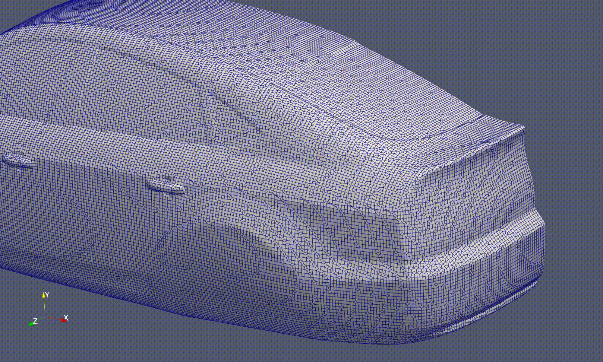

# DrivAer DAFoam Case

CFD optimization case for the DrivAer reference vehicle geometry using DAFoam.



## Prerequisites

- DAFoam (OpenFOAM v1812)

## Geometry

Download the DrivAer geometry from:
https://syncandshare.lrz.de/getlink/fiWzvig1b2BhKK2YQQW3Cs/

Place the geometry files in the appropriate directory before meshing. (constant/triSurface)

## Usage

### Mesh Generation

Run the preprocessing script to generate the mesh:

```bash
./preProcessing
```

### Running the Case

After meshing is complete, run the optimization:

```bash
decomposePar

mpirun -np 32 python runScript.py | tee log.txt
```

## Case Description

This case performs aerodynamic shape optimization on the DrivAer vehicle geometry using adjoint-based optimization methods provided by DAFoam.

